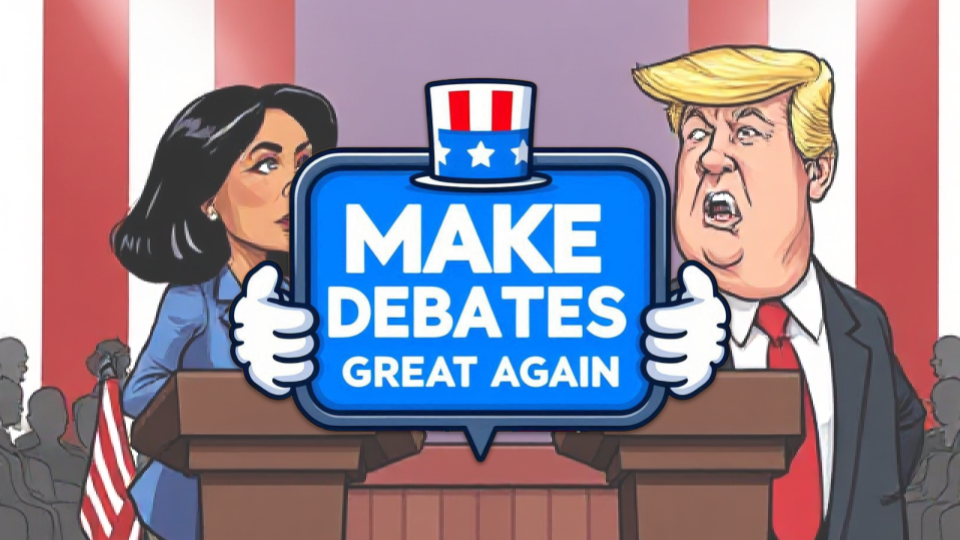

# Make Debates Great Again!

An awesome game built during the Mistral AI Gaming Hackathon **You Don't Control the Character** (@[Photoroom](https://www.photoroom.com/company), 24-26 January 2024)

Step into the shoes of a TV debate presenter tasked with helping a candidate win the election. Your mission? Polarize the public’s opinion by cleverly angling the debate against your opponent. Chose wisely your questions to stir up emotions, but beware—cross the line and you might push the opponent to leave the stage!

In our game, the player doesn't directly control the candidate seeking to win the debate by polarizing the opinion against his opponent. To reach this goal, the player controls the TV presenter who influences the course of the debates through carefully chosen questions. The presenter’s choices indirectly affect the debaters’ emotions and the public’s opinion. 

Our theme encouraged us to explore new ways of influencing characters and outcomes without directly controlling the characters themselves, which is exactly what our game proposes by steering the environment to make our champion win the game.

---
- [Make Debates Great Again!](#make-debates-great-again)
  - [Instructions](#instructions)
  - [Features](#features)
  - [Tech Stack](#tech-stack)
    - [Project architecture](#project-architecture)
    - [LLM backbones](#llm-backbones)
  - [Contributors](#contributors)
  - [License](#license)

---

## Instructions

Our game is playable on HuggingFace's [dedicated space]([google.com](https://huggingface.co/spaces/Mistral-AI-Game-Jam/Team15)). 

The debate begins, and the candidates start speaking in turn. When it’s the presenter’s turn, the player can choose to play a card from their hand to ask a question or let the debate continue.

The exchanges between the candidates affect their state of mind, particularly their level of anger. The angrier a candidate becomes, the more they polarize the audience against them. If a candidate gets too angry, they may suddenly leave the debate.

Certain cards are designed to provoke one candidate more than the other. They must be played strategically to help the Tycoon's preferred candidate win.

The player wins if they manage to polarize the public opinion against the opponent of the candidate chosen by the Tycoon when time runs out. To do this, they must anger the opponent. However, they must be careful not to anger them too much, as if any candidate leaves the debate, the player loses.

The player wins if, at the end of the time limit, they have succeeded in polarizing the opinion against the opponent of the Tycoon's chosen candidate, and no candidate has left the debate.

When it’s your turn, use the `Right Arrow` to navigate through the cards and press the `Spacebar` to play a card.

## Features

We extensively use MistralAI's LLM's 

des llm permettent de donner vie à nos personnages - les candidats et le présentateur en général les questions et 
nous utilisons également les llm de mistral pour évaluer l'état des candidats et savoir à quel point l'échange les énerve

* we also use the text-to-speech models to generate dialogues from the text. 

## Tech Stack

### Project architecture

The server project is hosted on a Scaleway server. This server communicates with a Unity client that controls the visual aspects of the Game 

### LLM backbones

we use Mistral AI LLMs 

. mention ici qu'on a prompté les LLM pour les empe^cher de générer du hatefulspeech

## Contributors

- (Gabriel Vidal)[https://github.com/GabrielVidal1]
- (Hugo Vasquez)[https://github.com/HugoVazquez-x]
- (Raphaël Jean)[https://github.com/RaphJean]
- (Louis Martnez)[https://github.com/lmartinez2001]
- (Yongkang Zou)[https://github.com/inin-zou]
- (Gabriel Kasmi)[https://github.com/gabrielkasmi]

## License
